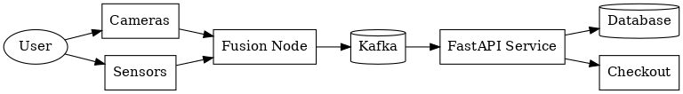
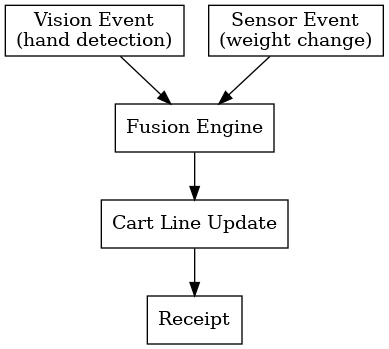
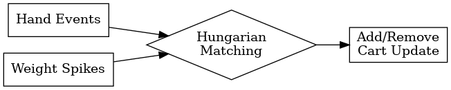
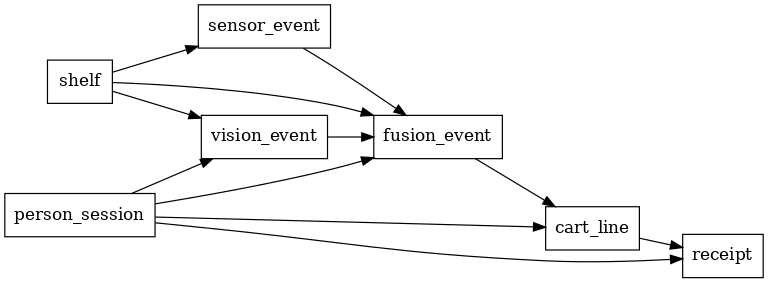

# 🛒 Cashierless Store (Amazon Go–Style MVP)

An end-to-end simulation of an **Amazon Go–style cashier-less store**, where shoppers can pick up items and walk out while AI + IoT systems automatically track items and generate receipts.

---

## 📌 Features
- 👤 Shopper session management (entry → exit)
- 🎥 Vision event simulation (hand-in-shelf events)
- ⚖️ Sensor event simulation (weight changes per shelf)
- 🔄 **Event Fusion Engine**: combines vision + sensor data into **virtual carts**
- 💳 FastAPI service for checkout with receipt generation
- 🗄️ Database schema for carts, receipts, sessions
- 📊 Diagrams for architecture, dataflow, ERD, and fusion logic

---

## 📂 Project Structure

```

cashierless-store/
│
├── docker-compose.yml         # Orchestration for services
├── requirements.txt           # Python dependencies
│
├── edge/
│   ├── fusion\_node.py         # Event fusion (vision+sensor → cart updates)
│   └── config.yaml            # Shelves, SKUs, item weights
│
├── services/
│   ├── api/
│   │   └── main.py            # FastAPI (enter/exit/checkout)
│   ├── db.py                  # DB connection + ORM models
│   └── schema.sql             # DB schema (Postgres/SQLite)
│
├── sim/
│   ├── vision\_events.py       # Simulated hand events
│   ├── sensor\_events.py       # Simulated weight changes
│   └── demo\_run.py            # End-to-end scenario runner
│
├── docs/
│   ├── architecture.png       # System architecture
│   ├── dataflow\.png           # Event/data pipeline
│   ├── fusion\_diagram.png     # Fusion engine logic
│   ├── erd.png                # DB entity-relationship diagram
│   └── demo\_screenshot.png    # Sample checkout receipt screenshot
│
└── README.md

````

---

## ⚙️ Setup

### 1. Clone repo
```bash
git clone https://github.com/hq969/cashierless-store-Amazon-Go-Style-MVP.git
cd cashierless-store
````

### 2. Install dependencies

```bash
pip install -r requirements.txt
```

### 3. Run database migrations

```bash
sqlite3 store.db < services/schema.sql
```

(For Postgres, update connection string in `db.py`)

### 4. Start API

```bash
uvicorn services.api.main:app --reload
```

### 5. Run simulation

```bash
python sim/demo_run.py
```

This simulates:

* Shopper entry
* Item pick/put actions
* Auto-checkout at exit
* Receipt printout

---

## 📊 System Diagrams

### 🏗️ Architecture



### 🔄 Dataflow



### ⚖️ Fusion Engine



### 🗄️ ERD



### 🛍️ Demo


---

## 🛠️ Tech Stack

* **Python**
* **FastAPI**
* **SQLite / Postgres**
* **Event Fusion (Vision + Sensor)**
* **Docker** (optional for orchestration)

---

## 🚀 Future Enhancements

* Integrate **YOLO + ByteTrack** for real camera vision events
* Real shelf weight sensors (HX711 + ESP32 publishing to MQTT/Kafka)
* Web dashboard for **live cart tracking** & audit console
* Payment integration (Stripe / UPI)
* Deploy with Kubernetes for scalability

---

## 📜 License

MIT License © 2025 Harsh Sonkar

---

## 🙌 Acknowledgements

Inspired by **Amazon Go** and cashier-less retail technology.

---
